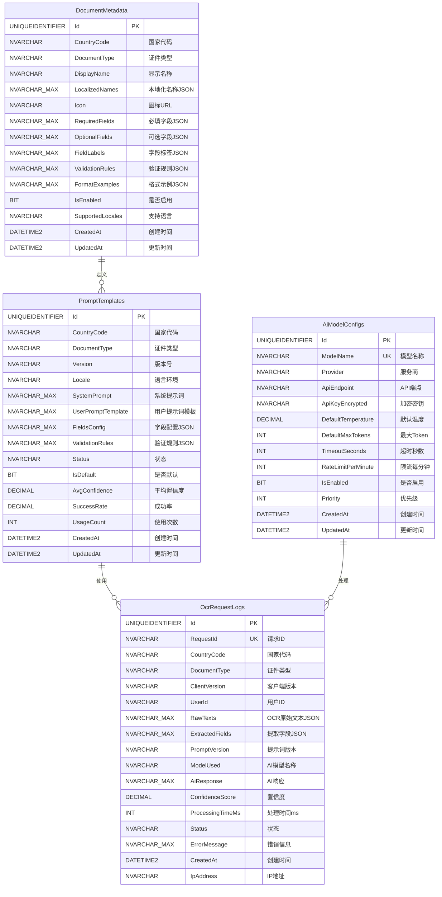

# AI-OCR 后端系统设计文档

## 1. 系统概述

### 1.1 目标

通过后端AI系统增强OCR识别准确率，为QuickVault提供高质量的证件信息提取服务。

### 1.2 核心优势

- **专业提示词工程**：针对每种证件类型定制系统提示词和用户提示词
- **AI上下文理解**：利用LLM理解OCR文本中的错误和上下文
- **动态模板管理**：支持在线更新提示词模板，无需客户端更新
- **多语言支持**：处理中英文混合、繁简体混合的OCR结果
- **智能纠错**：自动修正OCR常见错误（如"证"识别成"証"）

### 1.3 技术栈

- **后端框架**：ASP.NET Core 10 (C#)
- **AI模型**：Azure OpenAI / OpenAI GPT-4 / 国产模型（通义千问、文心一言）
- **数据库**：MS SQL Server 2022（关系型） + Redis（缓存）
- **部署**：Docker + Azure App Service / IIS

---

## 2. 系统架构

### 2.1 整体架构图

```
┌─────────────────┐
│  iOS Client     │
│  (QuickVault)   │
└────────┬────────┘
         │ HTTPS
         ▼
┌─────────────────────────────────────────┐
│         API Gateway (Nginx/Kong)        │
│  - Rate Limiting                        │
│  - Authentication                       │
│  - Load Balancing                       │
└────────┬────────────────────────────────┘
         │
         ▼
┌─────────────────────────────────────────┐
│     AI-Enhanced OCR Text Parser         │
│  ┌──────────────────────────────────┐   │
│  │  1. Text Preprocessing           │   │
│  │  2. AI Analysis (LLM)            │   │
│  │  3. Result Post-processing       │   │
│  │  4. Field Validation             │   │
│  └──────────────────────────────────┘   │
└────────┬────────────────────────────────┘
         │
    ┌────┴────┐
    ▼         ▼
┌─────────┐ ┌──────────────┐
│ Prompt  │ │   AI Model   │
│ Manager │ │   Service    │
│         │ │  (OpenAI/    │
│ (DB)    │ │   Claude)    │
└─────────┘ └──────────────┘
```

### 2.2 数据流程

```
1. Client (iOS):
   - 使用 Vision Framework 进行本地OCR
   - 提取文本数组（rawTexts）
   - 发送证件类型 + OCR文本（纯文本，不上传图片）
   
2. Backend Processing:
   - 接收OCR文本和证件类型
   - 加载对应证件类型的提示词模板
   - 构建AI请求（系统提示词 + 用户提示词 + OCR文本）
   - 调用LLM进行智能解析和字段提取
   - 结构化输出验证
   
3. Backend → Client:
   - 返回结构化字段数据
   - 置信度评分
   - 可能的修正建议
```

**核心架构原则**：

- ✅ **OCR在客户端完成**：iOS使用Vision Framework本地识别，无需上传图片
- ✅ **后端只做AI解析**：接收OCR文本，使用LLM智能提取结构化字段
- ✅ 图片数据保留在客户端本地，确保隐私安全
- ✅ 后端只处理文本数据，无需图片存储和OCR处理能力

---

## 3. API 设计

### 3.1 核心API端点

#### 3.1.1 智能OCR解析

```http
POST /api/v1/ocr/analyze
Content-Type: application/json
Authorization: Bearer <token>

Request Body:
{
  "documentType": "driversLicense",        // 证件类型
  "rawTexts": [                            // Vision OCR识别的文本数组
    "中华人民共和国机动车驾驶证",
    "证号",
    "61010219750116354X",
    "糕名 王晓燕",                          // 包含OCR错误
    "性别女",
    "出生日期1975-01-16"
  ],
  "clientVersion": "1.0.0",                // 客户端版本
  "locale": "zh-CN"                        // 语言偏好
}

Response (200 OK):
{
  "success": true,
  "data": {
    "documentType": "driversLicense",
    "confidence": 0.95,                    // 整体置信度
    "fields": {
      "name": {
        "value": "王晓燕",
        "confidence": 0.98,
        "corrected": true,                 // 标记是否纠错
        "originalValue": "糕名 王晓燕"     // 原始OCR值
      },
      "licenseNumber": {
        "value": "61010219750116354X",
        "confidence": 0.99,
        "corrected": false
      },
      "birthDate": {
        "value": "1975-01-16",
        "confidence": 0.97,
        "corrected": false
      },
      "gender": {
        "value": "女",
        "confidence": 0.99,
        "corrected": false
      }
    },
    "warnings": [                          // 可能的问题提示
      "初次领证日期未识别，请手动补充"
    ],
    "processingTime": 1234                 // 处理时间(ms)
  },
  "meta": {
    "requestId": "uuid-xxx-xxx",
    "timestamp": "2026-01-14T10:30:00Z",
    "modelUsed": "gpt-4-turbo",
    "promptVersion": "v2.3.1"
  }
}

Error Response (400 Bad Request):
{
  "success": false,
  "error": {
    "code": "INVALID_DOCUMENT_TYPE",
    "message": "不支持的证件类型",
    "details": {
      "supportedTypes": ["idCard", "passport", "driversLicense", ...]
    }
  }
}
```

#### 3.1.2 批量处理

```http
POST /api/v1/ocr/batch-analyze

Request Body:
{
  "documents": [
    {
      "id": "doc-1",
      "documentType": "idCard",
      "rawTexts": [...]
    },
    {
      "id": "doc-2",
      "documentType": "passport",
      "rawTexts": [...]
    }
  ]
}

Response:
{
  "success": true,
  "results": [
    {
      "id": "doc-1",
      "status": "success",
      "data": {...}
    },
    {
      "id": "doc-2",
      "status": "failed",
      "error": {...}
    }
  ]
}
```

#### 3.1.3 获取支持的证件类型

```http
GET /api/v1/ocr/document-types

Response:
{
  "success": true,
  "data": {
    "types": [
      {
        "id": "idCard",
        "name": "身份证 / ID Card",
        "fields": ["name", "idNumber", "gender", "birthDate", "address", ...],
        "currentPromptVersion": "v2.1.0"
      },
      {
        "id": "driversLicense",
        "name": "驾驶证 / Driver's License",
        "fields": ["name", "licenseNumber", "gender", ...],
        "currentPromptVersion": "v1.8.3"
      }
    ]
  }
}
```

#### 3.1.4 健康检查

```http
GET /api/v1/health

Response:
{
  "status": "healthy",
  "services": {
    "api": "up",
    "database": "up",
    "aiModel": "up",
    "redis": "up"
  },
  "version": "1.0.0"
}
```

---

## 4. 数据库设计 (MS SQL Server)

### 4.1 表结构

#### 4.1.1 提示词模板表 (PromptTemplates)

```sql
CREATE TABLE PromptTemplates (
    Id UNIQUEIDENTIFIER PRIMARY KEY DEFAULT NEWID(),
    DocumentType NVARCHAR(50) NOT NULL,        -- 证件类型
    Version NVARCHAR(20) NOT NULL,             -- 版本号 (语义化版本)
    Locale NVARCHAR(10) DEFAULT 'zh-CN',       -- 语言环境
    
    -- 提示词内容
    SystemPrompt NVARCHAR(MAX) NOT NULL,       -- 系统提示词
    UserPromptTemplate NVARCHAR(MAX) NOT NULL, -- 用户提示词模板
    
    -- 元数据
    Description NVARCHAR(MAX),                 -- 版本说明
    FieldsConfig NVARCHAR(MAX),                -- 字段配置 (JSON)
    ValidationRules NVARCHAR(MAX),             -- 验证规则 (JSON)
    
    -- 状态管理
    Status NVARCHAR(20) DEFAULT 'active',      -- active, deprecated, testing
    IsDefault BIT DEFAULT 0,                   -- 是否为默认版本
    
    -- 性能指标
    AvgConfidence DECIMAL(3,2),                -- 平均置信度
    SuccessRate DECIMAL(5,2),                  -- 成功率
    UsageCount INT DEFAULT 0,                  -- 使用次数
    
    -- 审计字段
    CreatedBy NVARCHAR(100),
    CreatedAt DATETIME2 DEFAULT GETDATE(),
    UpdatedAt DATETIME2 DEFAULT GETDATE(),
    
    CONSTRAINT UQ_Template UNIQUE(DocumentType, Version, Locale)
);

-- 索引
CREATE INDEX IX_Templates_Type_Status ON PromptTemplates(DocumentType, Status);
CREATE INDEX IX_Templates_Default ON PromptTemplates(DocumentType, IsDefault) WHERE IsDefault = 1;
```

#### 4.1.2 OCR请求日志表 (OcrRequestLogs)

```sql
CREATE TABLE OcrRequestLogs (
    Id UNIQUEIDENTIFIER PRIMARY KEY DEFAULT NEWID(),
    RequestId NVARCHAR(100) UNIQUE NOT NULL,
    
    -- 请求信息
    DocumentType NVARCHAR(50) NOT NULL,
    ClientVersion NVARCHAR(20),
    UserId NVARCHAR(100),                      -- 可选：用户标识
    
    -- OCR数据
    RawTexts NVARCHAR(MAX) NOT NULL,           -- OCR原始文本 (JSON)
    ExtractedFields NVARCHAR(MAX),             -- 提取的字段 (JSON)
    
    -- AI处理
    PromptVersion NVARCHAR(20),                -- 使用的提示词版本
    ModelUsed NVARCHAR(50),                    -- 使用的AI模型
    AiResponse NVARCHAR(MAX),                  -- AI原始响应
    
    -- 性能指标
    ConfidenceScore DECIMAL(3,2),              -- 置信度
    ProcessingTimeMs INT,                      -- 处理时间
    
    -- 结果状态
    Status NVARCHAR(20),                       -- success, failed, partial
    ErrorMessage NVARCHAR(MAX),
    
    -- 审计
    CreatedAt DATETIME2 DEFAULT GETDATE(),
    IpAddress NVARCHAR(45)
);

-- 索引
CREATE INDEX IX_Logs_Type_Created ON OcrRequestLogs(DocumentType, CreatedAt);
CREATE INDEX IX_Logs_User_Created ON OcrRequestLogs(UserId, CreatedAt);
```

#### 4.1.3 AI模型配置表 (AiModelConfigs)

```sql
CREATE TABLE AiModelConfigs (
    Id UNIQUEIDENTIFIER PRIMARY KEY DEFAULT NEWID(),
    ModelName NVARCHAR(50) NOT NULL UNIQUE,    -- gpt-4, azure-gpt-4, etc.
    
    -- API配置
    Provider NVARCHAR(50) NOT NULL,            -- openai, azure, aliyun
    ApiEndpoint NVARCHAR(500),
    ApiKeyEncrypted NVARCHAR(500),             -- 加密的API密钥
    
    -- 模型参数
    DefaultTemperature DECIMAL(2,1) DEFAULT 0.2,
    DefaultMaxTokens INT DEFAULT 2000,
    TimeoutSeconds INT DEFAULT 30,
    
    -- 限流配置
    RateLimitPerMinute INT DEFAULT 60,
    
    -- 状态
    IsEnabled BIT DEFAULT 1,
    Priority INT DEFAULT 0,                    -- 优先级（数字越大优先级越高）
    
    -- 审计
    CreatedAt DATETIME2 DEFAULT GETDATE(),
    UpdatedAt DATETIME2 DEFAULT GETDATE()
);
```

### 4.2 示例数据

#### 驾驶证提示词模板 (SQL Server)

```sql
INSERT INTO PromptTemplates (
    DocumentType,
    Version,
    Locale,
    SystemPrompt,
    UserPromptTemplate,
    Description,
    FieldsConfig,
    ValidationRules,
    IsDefault
) VALUES (
    'driversLicense',
    'v2.0.0',
    'zh-CN',
    
    -- System Prompt
    N'你是一个专业的中国驾驶证OCR文本解析专家。你的任务是从可能包含错误的OCR文本中准确提取驾驶证信息。

你需要了解的常见OCR错误：
- "姓名"可能被识别为"糕名"、"性名"
- "证"可能被识别为"証"
- 字母X可能被识别为"乂"或"义"
- 数字0可能被识别为字母O
- 地址中的"幢"可能被识别为"憧"

你需要提取的字段：
1. name (姓名)：2-4个中文字符
2. licenseNumber (证号)：通常为18位数字或17位数字+字母X
3. gender (性别)：男 或 女
4. nationality (国籍)：通常为"中国"
5. birthDate (出生日期)：YYYY-MM-DD 格式
6. address (住址)：完整地址，排除英文标签
7. issueDate (初次领证日期)：YYYY-MM-DD 格式
8. validFrom (有效起始日期)：YYYY-MM-DD 格式
9. validUntil (有效期限)：YYYY-MM-DD 格式
10. licenseClass (准驾车型)：如 C1, C2, B2, A1 等

输出要求：
- 必须输出JSON格式
- 只包含确定识别出的字段
- 每个字段包含value和confidence（0-1之间）
- 如果某个字段不确定或未找到，不要输出该字段
- 自动纠正明显的OCR错误',

    -- User Prompt Template
    N'请从以下OCR识别的文本中提取驾驶证信息。这些文本可能包含识别错误，请智能纠正。

OCR文本（按行）：
{{raw_texts}}

请输出JSON格式的结果，格式如下：
{
  "fields": {
    "name": {"value": "...", "confidence": 0.95},
    "licenseNumber": {"value": "...", "confidence": 0.98}
  },
  "corrections": [
    {"field": "name", "original": "糕名 王晓燕", "corrected": "王晓燕", "reason": "OCR误识别"}
  ]
}',

    -- Description
    N'驾驶证识别v2.0 - 增强OCR错误纠正能力，支持分行字段提取',
    
    -- Fields Config (JSON字符串)
    N'{
      "required": ["name", "licenseNumber", "birthDate"],
      "optional": ["gender", "nationality", "address", "issueDate", "validFrom", "validUntil", "licenseClass"],
      "formats": {
        "birthDate": "YYYY-MM-DD",
        "issueDate": "YYYY-MM-DD",
        "validFrom": "YYYY-MM-DD",
        "validUntil": "YYYY-MM-DD"
      }
    }',
    
    -- Validation Rules (JSON字符串)
    N'{
      "licenseNumber": {
        "pattern": "^\\d{17}[0-9Xx]$|^\\d{12}$",
        "message": "驾照号码格式不正确"
      },
      "gender": {
        "enum": ["男", "女"],
        "message": "性别只能是男或女"
      },
      "licenseClass": {
        "pattern": "^[A-D][1-3]$",
        "message": "准驾车型格式不正确"
      }
    }',
    
    1  -- IsDefault
);
```

### 4.3 数据库ER图

#### 4.3.1 核心实体关系



#### 4.3.2 关系说明

**PromptTemplates → OcrRequestLogs (一对多)**

- 一个提示词模板版本可以被多次OCR请求使用
- 外键：`OcrRequestLogs.PromptVersion` 关联 `PromptTemplates.Version`
- 用于追踪哪个版本的提示词产生了什么样的结果

**AiModelConfigs → OcrRequestLogs (一对多)**

- 一个AI模型配置可以处理多个OCR请求
- 外键：`OcrRequestLogs.ModelUsed` 关联 `AiModelConfigs.ModelName`
- 用于性能对比和模型选择优化

**DocumentMetadata → PromptTemplates (一对多)**

- 一种证件类型元数据对应多个提示词版本（不同国家、语言、版本）
- 外键：`PromptTemplates.CountryCode + DocumentType` 关联 `DocumentMetadata.CountryCode + DocumentType`
- 定义证件的标准字段和验证规则

#### 4.3.3 索引策略

```sql
-- PromptTemplates 索引
CREATE UNIQUE INDEX UQ_Template_Country 
ON PromptTemplates(CountryCode, DocumentType, Version, Locale);

CREATE INDEX IX_Templates_Type_Status 
ON PromptTemplates(DocumentType, Status);

CREATE INDEX IX_Templates_Country 
ON PromptTemplates(CountryCode, DocumentType);

CREATE INDEX IX_Templates_Default 
ON PromptTemplates(DocumentType, IsDefault) WHERE IsDefault = 1;

-- OcrRequestLogs 索引
CREATE UNIQUE INDEX UQ_RequestId 
ON OcrRequestLogs(RequestId);

CREATE INDEX IX_Logs_Type_Created 
ON OcrRequestLogs(DocumentType, CreatedAt);

CREATE INDEX IX_Logs_Country_Created 
ON OcrRequestLogs(CountryCode, CreatedAt);

CREATE INDEX IX_Logs_User_Created 
ON OcrRequestLogs(UserId, CreatedAt) WHERE UserId IS NOT NULL;

CREATE INDEX IX_Logs_Status 
ON OcrRequestLogs(Status, CreatedAt);

-- DocumentMetadata 索引
CREATE UNIQUE INDEX UQ_Document_Metadata 
ON DocumentMetadata(CountryCode, DocumentType);

CREATE INDEX IX_Metadata_Enabled 
ON DocumentMetadata(IsEnabled) WHERE IsEnabled = 1;
```

#### 4.3.4 外键约束（可选）

```sql
-- 如果需要强制引用完整性，可以添加外键约束
-- 注意：由于使用字符串关联，可能影响性能

-- OcrRequestLogs → PromptTemplates
ALTER TABLE OcrRequestLogs
ADD CONSTRAINT FK_Logs_PromptVersion
FOREIGN KEY (DocumentType, PromptVersion, Locale)
REFERENCES PromptTemplates(DocumentType, Version, Locale)
ON DELETE NO ACTION;

-- OcrRequestLogs → AiModelConfigs
ALTER TABLE OcrRequestLogs
ADD CONSTRAINT FK_Logs_ModelUsed
FOREIGN KEY (ModelUsed)
REFERENCES AiModelConfigs(ModelName)
ON DELETE NO ACTION;

-- PromptTemplates → DocumentMetadata
ALTER TABLE PromptTemplates
ADD CONSTRAINT FK_Templates_Metadata
FOREIGN KEY (CountryCode, DocumentType)
REFERENCES DocumentMetadata(CountryCode, DocumentType)
ON DELETE CASCADE;
```

#### 4.3.5 完整架构视图

```
┌─────────────────────────────────────────────────────────────────┐
│                       AI-OCR Backend 数据架构                     │
└─────────────────────────────────────────────────────────────────┘

┌──────────────────────┐
│  DocumentMetadata    │  ← 证件类型元数据（国家+类型）
│  ──────────────────  │
│  • CountryCode (PK)  │
│  • DocumentType (PK) │
│  • RequiredFields    │
│  • ValidationRules   │
│  • LocalizedNames    │
└──────────┬───────────┘
           │ 1:N
           ↓
┌──────────────────────┐     1:N      ┌──────────────────────┐
│  PromptTemplates     │──────────────→│  OcrRequestLogs      │
│  ──────────────────  │              │  ──────────────────  │
│  • Id (PK)           │              │  • Id (PK)           │
│  • CountryCode       │              │  • RequestId (UK)    │
│  • DocumentType      │  使用         │  • CountryCode       │
│  • Version           │───────────→  │  • DocumentType      │
│  • SystemPrompt      │              │  • PromptVersion     │
│  • IsDefault         │              │  • ModelUsed         │
│  • SuccessRate       │              │  • RawTexts          │
│  • UsageCount        │              │  • ExtractedFields   │
└──────────────────────┘              │  • ConfidenceScore   │
                                      │  • Status            │
                                      └──────────┬───────────┘
                                                 │ N:1
                                                 ↓
                                      ┌──────────────────────┐
                                      │  AiModelConfigs      │
                                      │  ──────────────────  │
                                      │  • Id (PK)           │
                                      │  • ModelName (UK)    │
                                      │  • Provider          │
                                      │  • ApiEndpoint       │
                                      │  • RateLimitPerMin   │
                                      │  • Priority          │
                                      └──────────────────────┘

数据流:
1. DocumentMetadata 定义支持的证件类型及其字段规范
2. PromptTemplates 为每种证件类型的国家/语言变体提供AI提示词
3. OcrRequestLogs 记录每次OCR请求，关联使用的提示词版本和AI模型
4. AiModelConfigs 配置可用的AI模型及其参数
```

#### 4.3.6 查询示例

**获取中国驾照的最新默认提示词：**

```sql
SELECT TOP 1 *
FROM PromptTemplates
WHERE CountryCode = 'CN'
  AND DocumentType = 'driversLicense'
  AND IsDefault = 1
  AND Status = 'active'
ORDER BY CreatedAt DESC;
```

**统计各证件类型的识别成功率：**

```sql
SELECT 
    CountryCode,
    DocumentType,
    COUNT(*) AS TotalRequests,
    SUM(CASE WHEN Status = 'success' THEN 1 ELSE 0 END) AS SuccessCount,
    CAST(SUM(CASE WHEN Status = 'success' THEN 1 ELSE 0 END) * 100.0 / COUNT(*) AS DECIMAL(5,2)) AS SuccessRate,
    AVG(ConfidenceScore) AS AvgConfidence,
    AVG(ProcessingTimeMs) AS AvgProcessingTime
FROM OcrRequestLogs
WHERE CreatedAt >= DATEADD(DAY, -7, GETDATE())
GROUP BY CountryCode, DocumentType
ORDER BY TotalRequests DESC;
```

**对比不同AI模型的性能：**

```sql
SELECT 
    ModelUsed,
    COUNT(*) AS RequestCount,
    AVG(ConfidenceScore) AS AvgConfidence,
    AVG(ProcessingTimeMs) AS AvgLatency,
    SUM(CASE WHEN Status = 'success' THEN 1 ELSE 0 END) * 100.0 / COUNT(*) AS SuccessRate
FROM OcrRequestLogs
WHERE CreatedAt >= DATEADD(DAY, -1, GETDATE())
GROUP BY ModelUsed
ORDER BY SuccessRate DESC, AvgConfidence DESC;
```

---

## 5. 提示词工程策略

### 5.1 提示词设计原则

#### 系统提示词 (System Prompt)

```markdown
角色定义清晰 → 专业背景 → 任务目标 → 约束条件 → 输出格式
```

#### 用户提示词 (User Prompt)

```markdown
上下文信息 → 输入数据 → 具体要求 → 示例(Few-shot) → 输出格式
```

### 5.2 各证件类型提示词要点

#### 身份证 (ID Card)

```
重点：
- 18位身份证号校验（最后一位可能是X）
- 住址完整性（省市区详细地址）
- 有效期格式（YYYY.MM.DD-YYYY.MM.DD 或 长期）
- 民族识别（56个民族）

常见OCR错误：
- "身份证"→"身分证"
- "签发机关"→"鉴发机关"
- "X"→"乂"、"义"
```

#### 护照 (Passport)

```
重点：
- MRZ (Machine Readable Zone) 解析
- 护照号格式（E开头 + 8位数字）
- 英文姓名大写
- 国籍标准化

特殊处理：
- 中英文姓名对应
- 出生地代码
- 签发地代码
```

#### 营业执照 (Business License)

```
重点：
- 统一社会信用代码（18位字母数字）
- 企业名称完整性
- 注册资本数字和单位
- 经营范围长文本

难点：
- "名称"可能分行为"名"和"称"
- 金额数字识别
```

### 5.3 提示词模板变量

```python
# 用户提示词支持的变量
{
    "{{raw_texts}}": "OCR原始文本数组，JSON格式化",
    "{{document_type}}": "证件类型",
    "{{locale}}": "语言环境",
    "{{client_hints}}": "客户端提供的额外提示",
    "{{field_requirements}}": "必填/可选字段说明"
}
```

---

## 6. 安全与隐私

### 6.1 数据安全

#### 传输层安全

```
- 强制HTTPS (TLS 1.3)
- Certificate Pinning（证书固定）
- API密钥轮换机制
```

#### 数据脱敏

```csharp
// C# 日志中脱敏敏感字段
public static string MaskSensitiveData(string fieldName, string value)
{
    var sensitiveFields = new[] { "idNumber", "licenseNumber", "passportNumber" };
    
    if (sensitiveFields.Contains(fieldName) && value.Length > 5)
    {
        // 保留前3位和后2位，中间用*替代
        return value.Substring(0, 3) + new string('*', value.Length - 5) + value.Substring(value.Length - 2);
    }
    
    return value;
}
```

#### 数据处理原则

```
✅ 客户端只发送OCR文本，不上传原始图片
✅ 图片数据保留在客户端本地，确保隐私安全
✅ 后端只处理文本数据，无需图片存储
✅ 敏感字段在日志中自动脱敏
✅ 请求日志定期清理（建议30天）
```

### 6.2 访问控制

#### API认证 (ASP.NET Core)

```csharp
// 方案1: API Key + HMAC签名
public class ApiKeyAuthenticationHandler : AuthenticationHandler<ApiKeyAuthenticationOptions>
{
    protected override async Task<AuthenticateResult> HandleAuthenticateAsync()
    {
        if (!Request.Headers.TryGetValue("Authorization", out var authHeader))
            return AuthenticateResult.Fail("Missing Authorization Header");
        
        var apiKey = authHeader.ToString().Replace("Bearer ", "");
        
        // 验证API Key
        if (!await _apiKeyValidator.ValidateAsync(apiKey))
            return AuthenticateResult.Fail("Invalid API Key");
        
        // 验证签名
        if (!await ValidateSignature(Request))
            return AuthenticateResult.Fail("Invalid Signature");
        
        var claims = new[] { new Claim("apikey", apiKey) };
        var identity = new ClaimsIdentity(claims, Scheme.Name);
        var principal = new ClaimsPrincipal(identity);
        var ticket = new AuthenticationTicket(principal, Scheme.Name);
        
        return AuthenticateResult.Success(ticket);
    }
}

// 方案2: JWT Token
[Authorize(AuthenticationSchemes = JwtBearerDefaults.AuthenticationScheme)]
public class OcrController : ControllerBase
{
    // ...
}
```

#### 速率限制 (ASP.NET Core)

```csharp
// 使用 AspNetCoreRateLimit 中间件
public void ConfigureServices(IServiceCollection services)
{
    // 配置速率限制
    services.Configure<IpRateLimitOptions>(Configuration.GetSection("IpRateLimiting"));
    services.AddSingleton<IIpPolicyStore, MemoryCacheIpPolicyStore>();
    services.AddSingleton<IRateLimitCounterStore, MemoryCacheRateLimitCounterStore>();
    services.AddSingleton<IRateLimitConfiguration, RateLimitConfiguration>();
}

// appsettings.json
{
  "IpRateLimiting": {
    "EnableEndpointRateLimiting": true,
    "StackBlockedRequests": false,
    "GeneralRules": [
      {
        "Endpoint": "POST:/api/v1/ocr/analyze",
        "Period": "1m",
        "Limit": 60
      },
      {
        "Endpoint": "POST:/api/v1/ocr/analyze",
        "Period": "1h",
        "Limit": 1000
      }
    ]
  }
}
```

### 6.3 合规性

```
GDPR / PIPL 合规要点:
✅ 用户数据最小化收集（仅收集必要的OCR文本）
✅ 明确的数据使用目的（仅用于AI解析，不做其他用途）
✅ 数据删除权实现（支持用户删除历史记录）
✅ 处理记录保存（完整的审计日志）
✅ 数据跨境传输合规（如使用Azure中国区）
✅ 不存储用户图片（降低隐私风险）
```

---

## 7. 性能优化

### 7.1 缓存策略 (Redis + .NET)

```csharp
// IDistributedCache 使用示例
public class PromptCacheService
{
    private readonly IDistributedCache _cache;
    
    public async Task<PromptTemplate> GetCachedPromptAsync(string documentType, string locale)
    {
        var cacheKey = $"prompt:template:{documentType}:{locale}";
        var cached = await _cache.GetStringAsync(cacheKey);
        
        if (cached != null)
        {
            return JsonSerializer.Deserialize<PromptTemplate>(cached);
        }
        
        // 从数据库加载
        var template = await _dbContext.PromptTemplates
            .FirstOrDefaultAsync(t => 
                t.DocumentType == documentType && 
                t.Locale == locale && 
                t.IsDefault);
        
        if (template != null)
        {
            // 缓存1小时
            var options = new DistributedCacheEntryOptions
            {
                AbsoluteExpirationRelativeToNow = TimeSpan.FromHours(1)
            };
            await _cache.SetStringAsync(cacheKey, 
                JsonSerializer.Serialize(template), options);
        }
        
        return template;
    }
}

// 缓存配置
services.AddStackExchangeRedisCache(options =>
{
    options.Configuration = Configuration.GetConnectionString("Redis");
    options.InstanceName = "QuickVaultOcr:";
});
```

### 7.2 异步处理

```
同步API: 适用于实时交互场景
- 超时时间: 10秒
- 适用于单个文档

异步API: 适用于批量处理
- Webhook回调
- 任务队列(Celery/RQ)
- 进度查询接口
```

### 7.3 AI模型优化

```yaml
strategies:
  model_selection:
    - 简单证件(身份证): 使用GPT-3.5-turbo (成本低、速度快)
    - 复杂证件(营业执照): 使用GPT-4 (准确率高)
  
  prompt_optimization:
    - Few-shot examples (2-3个示例)
    - 结构化输出（JSON mode）
    - Token数量控制（System prompt < 500 tokens）
  
  fallback_mechanism:
    - Primary: GPT-4
    - Fallback1: GPT-3.5-turbo
    - Fallback2: 本地规则引擎
```

---

## 8. 监控与运维

### 8.1 关键指标

```yaml
业务指标:
  - 识别成功率
  - 平均置信度
  - 字段级准确率
  - 纠错率

技术指标:
  - API响应时间 (P50, P95, P99)
  - AI模型调用延迟
  - 错误率
  - 并发请求数

成本指标:
  - AI Token消耗
  - 每次请求成本
  - 基础设施成本
```

### 8.2 告警规则

```yaml
alerts:
  - name: 高错误率
    condition: error_rate > 5% for 5 minutes
    severity: critical
  
  - name: 响应时间过长
    condition: p95_latency > 3000ms for 10 minutes
    severity: warning
  
  - name: AI模型不可用
    condition: ai_service_down
    severity: critical
```

---

## 9. 部署方案

### 9.1 推荐架构

```yaml
环境:
  - 开发环境 (dev)
  - 测试环境 (staging)
  - 生产环境 (production)

生产环境:
  api_servers:
    - 实例数: 3+ (自动扩缩容)
    - 规格: 2 vCPU, 4GB RAM
  
  database:
    - PostgreSQL 14+ (主从复制)
    - 规格: 4 vCPU, 16GB RAM
  
  redis:
    - Redis 7+ (Sentinel模式)
    - 规格: 2 vCPU, 8GB RAM
```

### 9.2 CI/CD流程

```yaml
pipeline:
  1. Code Review (GitHub PR)
  2. Automated Tests (Unit + Integration)
  3. Build Docker Image
  4. Deploy to Staging
  5. Smoke Tests
  6. Manual Approval
  7. Blue-Green Deployment to Production
  8. Health Check
  9. Rollback if needed
```

---

## 10. 成本估算

### 10.1 AI模型成本

```
GPT-4-Turbo 定价 (2026年1月):
- Input: $0.01 / 1K tokens
- Output: $0.03 / 1K tokens

单次请求估算:
- System Prompt: ~400 tokens
- User Prompt + OCR Text: ~300 tokens
- Output: ~200 tokens
- 总成本: ($0.01 * 0.7 + $0.03 * 0.2) = $0.013/请求

月成本估算 (10万次请求):
- AI成本: $1,300
- 基础设施: $500
- 总计: ~$1,800/月
```

### 10.2 成本优化建议

```
1. 智能路由: 简单证件用GPT-3.5，复杂证件用GPT-4
2. 结果缓存: 相同OCR文本直接返回缓存结果
3. 批量处理: 批量请求共享context，降低token消耗
4. 自托管方案: 使用开源模型（Llama 3, Qwen等）
```

---

## 10. 国际化支持 (i18n)

### 10.1 多国证件支持策略

QuickVault支持全球主要国家和地区的证件识别，采用国家/地区代码 + 证件类型的组合方式。

#### 10.1.1 证件类型命名规范

```
格式: {country_code}_{document_type}

示例:
- cn_id_card          中国身份证
- cn_drivers_license  中国驾驶证
- cn_passport         中国护照
- us_drivers_license  美国驾照
- us_passport         美国护照
- uk_passport         英国护照
- jp_drivers_license  日本驾照
- de_id_card          德国身份证
- fr_passport         法国护照
```

#### 10.1.2 支持的国家和证件类型

| 国家/地区 | 代码 | 身份证 | 驾照 | 护照 | 其他 |
|---------|------|-------|------|------|------|
| 🇨🇳 中国 | CN | ✅ | ✅ | ✅ | 营业执照、社保卡 |
| 🇺🇸 美国 | US | ❌ | ✅ | ✅ | SSN卡、绿卡 |
| 🇬🇧 英国 | UK | ✅ | ✅ | ✅ | - |
| 🇯🇵 日本 | JP | ✅ | ✅ | ✅ | 在留卡 |
| 🇩🇪 德国 | DE | ✅ | ✅ | ✅ | - |
| 🇫🇷 法国 | FR | ✅ | ✅ | ✅ | - |
| 🇰🇷 韩国 | KR | ✅ | ✅ | ✅ | - |
| 🇨🇦 加拿大 | CA | ❌ | ✅ | ✅ | 健康卡 |
| 🇦🇺 澳洲 | AU | ✅ | ✅ | ✅ | - |
| 🇸🇬 新加坡 | SG | ✅ | ✅ | ✅ | - |

### 10.2 数据库设计调整

#### 10.2.1 扩展提示词模板表

```sql
-- 添加国家/地区字段
ALTER TABLE PromptTemplates 
ADD CountryCode NVARCHAR(10) NOT NULL DEFAULT 'CN';

-- 添加组合唯一索引
CREATE UNIQUE INDEX UQ_Template_Country 
ON PromptTemplates(CountryCode, DocumentType, Version, Locale);

-- 添加国家/地区索引
CREATE INDEX IX_Templates_Country 
ON PromptTemplates(CountryCode, DocumentType);
```

#### 10.2.2 证件元数据表

```sql
CREATE TABLE DocumentMetadata (
    Id UNIQUEIDENTIFIER PRIMARY KEY DEFAULT NEWID(),
    CountryCode NVARCHAR(10) NOT NULL,
    DocumentType NVARCHAR(50) NOT NULL,
    
    -- 显示信息
    DisplayName NVARCHAR(200) NOT NULL,      -- 多语言显示名
    LocalizedNames NVARCHAR(MAX),            -- JSON: {"en": "ID Card", "zh-CN": "身份证"}
    Icon NVARCHAR(500),                      -- 图标URL
    
    -- 字段定义
    RequiredFields NVARCHAR(MAX) NOT NULL,   -- JSON数组
    OptionalFields NVARCHAR(MAX),            -- JSON数组
    FieldLabels NVARCHAR(MAX),               -- JSON: 多语言字段标签
    
    -- 验证规则
    ValidationRules NVARCHAR(MAX),           -- JSON: 字段验证规则
    FormatExamples NVARCHAR(MAX),            -- JSON: 字段格式示例
    
    -- 状态
    IsEnabled BIT DEFAULT 1,
    SupportedLocales NVARCHAR(500),          -- 支持的语言: en,zh-CN,ja
    
    CreatedAt DATETIME2 DEFAULT GETDATE(),
    UpdatedAt DATETIME2 DEFAULT GETDATE(),
    
    CONSTRAINT UQ_Document_Metadata UNIQUE(CountryCode, DocumentType)
);
```

### 10.3 API请求格式调整

```json
{
  "documentType": "driversLicense",
  "countryCode": "US",                      // 新增：国家代码
  "rawTexts": [...],
  "clientVersion": "1.0.0",
  "locale": "en-US"                         // 优先使用的语言
}
```

### 10.4 不同国家证件的提示词示例

#### 10.4.1 美国驾照 (US Driver's License)

```sql
INSERT INTO PromptTemplates (
    CountryCode,
    DocumentType,
    Version,
    Locale,
    SystemPrompt,
    UserPromptTemplate,
    ...
) VALUES (
    'US',
    'driversLicense',
    'v1.0.0',
    'en-US',
    
    -- System Prompt
    N'You are an expert in US Driver''s License OCR text parsing. Extract information from potentially error-prone OCR text.

Common OCR errors:
- "License" may be recognized as "Licence"
- Number 0 may be recognized as letter O
- Letter I may be recognized as number 1

Fields to extract:
1. fullName: Full name (First Middle Last)
2. licenseNumber: Format varies by state (e.g., CA: A1234567)
3. dateOfBirth: MM/DD/YYYY format
4. address: Full address
5. issueDate: MM/DD/YYYY
6. expirationDate: MM/DD/YYYY
7. class: License class (A, B, C, etc.)
8. restrictions: Any restrictions
9. state: Issuing state (2-letter code)

Output JSON format only with confirmed fields.',

    -- User Prompt Template
    N'Extract driver''s license information from the following OCR text:

OCR Text:
{{raw_texts}}

Output format:
{
  "fields": {
    "fullName": {"value": "...", "confidence": 0.95},
    "licenseNumber": {"value": "...", "confidence": 0.98}
  }
}',
    
    ...
);
```

#### 10.4.2 日本驾照 (Japanese Driver's License)

```sql
INSERT INTO PromptTemplates (
    CountryCode,
    DocumentType,
    Version,
    Locale,
    SystemPrompt,
    ...
) VALUES (
    'JP',
    'driversLicense',
    'v1.0.0',
    'ja-JP',
    
    -- System Prompt
    N'あなたは日本の運転免許証のOCRテキスト解析の専門家です。

よくあるOCRエラー：
- 「免許」が「免詐」と認識される
- 「証」が「証」と認識される
- 数字の0が英字のOと認識される

抽出するフィールド：
1. name (氏名)：漢字表記
2. licenseNumber (免許証番号)：12桁の数字
3. birthDate (生年月日)：和暦または西暦
4. address (住所)：都道府県から番地まで
5. issueDate (交付年月日)
6. expirationDate (有効期限)
7. licenseClass (免許の種類)：普通、大型など

JSON形式で出力してください。',
    
    ...
);
```

#### 10.4.3 英国护照 (UK Passport)

```sql
INSERT INTO PromptTemplates (
    CountryCode,
    DocumentType,
    Version,
    Locale,
    SystemPrompt,
    ...
) VALUES (
    'UK',
    'passport',
    'v1.0.0',
    'en-GB',
    
    -- System Prompt
    N'You are a UK Passport OCR text parsing expert.

UK Passport specific fields:
1. surname: Surname (family name)
2. givenNames: Given name(s)
3. passportNumber: 9 alphanumeric characters
4. nationality: British Citizen / British Overseas, etc.
5. dateOfBirth: DD MMM YYYY (e.g., 15 JAN 1990)
6. placeOfBirth: City, Country
7. dateOfIssue: DD MMM YYYY
8. dateOfExpiry: DD MMM YYYY
9. authority: UK Passport Office

MRZ (Machine Readable Zone):
- Two lines of 44 characters each
- Contains encoded information

Extract all available fields from both visual inspection zone and MRZ.',
    
    ...
);
```

### 10.5 多语言字段映射

#### 10.5.1 字段标签本地化

```csharp
// 字段标签多语言配置
public class FieldLabels
{
    public static readonly Dictionary<string, Dictionary<string, string>> Labels = new()
    {
        ["name"] = new()
        {
            ["en-US"] = "Full Name",
            ["zh-CN"] = "姓名",
            ["ja-JP"] = "氏名",
            ["ko-KR"] = "이름",
            ["es-ES"] = "Nombre Completo",
            ["fr-FR"] = "Nom Complet",
            ["de-DE"] = "Vollständiger Name"
        },
        ["birthDate"] = new()
        {
            ["en-US"] = "Date of Birth",
            ["zh-CN"] = "出生日期",
            ["ja-JP"] = "生年月日",
            ["ko-KR"] = "생년월일",
            ["es-ES"] = "Fecha de Nacimiento",
            ["fr-FR"] = "Date de Naissance",
            ["de-DE"] = "Geburtsdatum"
        },
        // ... 更多字段
    };
}
```

#### 10.5.2 日期格式处理

```csharp
public class DateFormatConverter
{
    // 各国常用日期格式
    private static readonly Dictionary<string, string[]> DateFormats = new()
    {
        ["US"] = new[] { "MM/dd/yyyy", "MMM dd, yyyy" },
        ["CN"] = new[] { "yyyy-MM-dd", "yyyy年MM月dd日" },
        ["UK"] = new[] { "dd/MM/yyyy", "dd MMM yyyy" },
        ["JP"] = new[] { "yyyy年MM月dd日", "yyyy/MM/dd", "R02.03.15" }, // 和暦
        ["DE"] = new[] { "dd.MM.yyyy" },
        ["FR"] = new[] { "dd/MM/yyyy" }
    };
    
    public static DateTime? ParseDate(string dateString, string countryCode)
    {
        if (!DateFormats.TryGetValue(countryCode, out var formats))
            formats = DateFormats["US"]; // 默认美国格式
        
        foreach (var format in formats)
        {
            if (DateTime.TryParseExact(dateString, format, 
                CultureInfo.InvariantCulture, 
                DateTimeStyles.None, 
                out var result))
            {
                return result;
            }
        }
        
        // 尝试通用解析
        if (DateTime.TryParse(dateString, out var genericResult))
            return genericResult;
        
        return null;
    }
}
```

### 10.6 证件字段国际化映射

```csharp
public class DocumentFieldMapping
{
    // 不同国家的字段映射规则
    public static Dictionary<string, Dictionary<string, string>> FieldMappings = new()
    {
        // 美国驾照
        ["US_driversLicense"] = new()
        {
            ["DL"] = "licenseNumber",           // DL No. -> licenseNumber
            ["DOB"] = "birthDate",              // DOB -> birthDate
            ["EXP"] = "expirationDate",         // EXP -> expirationDate
            ["ISS"] = "issueDate",              // ISS -> issueDate
            ["CLASS"] = "licenseClass",
            ["RSTR"] = "restrictions"
        },
        
        // 日本驾照
        ["JP_driversLicense"] = new()
        {
            ["氏名"] = "name",
            ["生年月日"] = "birthDate",
            ["住所"] = "address",
            ["交付"] = "issueDate",
            ["有効期限"] = "expirationDate",
            ["免許証番号"] = "licenseNumber",
            ["種類"] = "licenseClass"
        },
        
        // 英国护照
        ["UK_passport"] = new()
        {
            ["Surname"] = "surname",
            ["Given names"] = "givenNames",
            ["Nationality"] = "nationality",
            ["Date of birth"] = "birthDate",
            ["Place of birth"] = "placeOfBirth",
            ["Date of issue"] = "issueDate",
            ["Date of expiry"] = "expirationDate",
            ["Authority"] = "issuingAuthority"
        }
    };
}
```

### 10.7 特殊格式处理

#### 10.7.1 护照MRZ解析

```csharp
public class MrzParser
{
    /// <summary>
    /// 解析护照MRZ (Machine Readable Zone)
    /// </summary>
    public static Dictionary<string, string> ParsePassportMrz(string line1, string line2)
    {
        // MRZ格式: 两行，每行44个字符
        // 第一行: P<COUNTRY<<<SURNAME<<GIVEN_NAMES
        // 第二行: PASSPORT_NO<CHECK<NATIONALITY<DOB<GENDER<EXPIRY<PERSONAL_NO
        
        var result = new Dictionary<string, string>();
        
        if (line1?.Length >= 44)
        {
            // 国家代码
            result["country"] = line1.Substring(2, 3).Replace("<", "");
            
            // 解析姓名
            var namePart = line1.Substring(5, 39).TrimEnd('<');
            var nameParts = namePart.Split(new[] { "<<" }, StringSplitOptions.None);
            if (nameParts.Length >= 2)
            {
                result["surname"] = nameParts[0].Replace("<", " ").Trim();
                result["givenNames"] = nameParts[1].Replace("<", " ").Trim();
            }
        }
        
        if (line2?.Length >= 44)
        {
            // 护照号
            result["passportNumber"] = line2.Substring(0, 9).Replace("<", "");
            
            // 国籍
            result["nationality"] = line2.Substring(10, 3).Replace("<", "");
            
            // 出生日期 (YYMMDD)
            var dobRaw = line2.Substring(13, 6);
            result["birthDate"] = ParseMrzDate(dobRaw);
            
            // 性别
            result["gender"] = line2.Substring(20, 1) == "M" ? "Male" : "Female";
            
            // 有效期 (YYMMDD)
            var expiryRaw = line2.Substring(21, 6);
            result["expiryDate"] = ParseMrzDate(expiryRaw);
        }
        
        return result;
    }
    
    private static string ParseMrzDate(string mrzDate)
    {
        // YYMMDD -> YYYY-MM-DD
        if (mrzDate.Length != 6) return mrzDate;
        
        var year = int.Parse(mrzDate.Substring(0, 2));
        var fullYear = year > 50 ? 1900 + year : 2000 + year;
        var month = mrzDate.Substring(2, 2);
        var day = mrzDate.Substring(4, 2);
        
        return $"{fullYear}-{month}-{day}";
    }
}
```

#### 10.7.2 日本和历处理

```csharp
public class JapaneseEraConverter
{
    private static readonly Dictionary<string, (int StartYear, string EraName)> Eras = new()
    {
        ["令和"] = (2019, "Reiwa"),    // R
        ["平成"] = (1989, "Heisei"),   // H
        ["昭和"] = (1926, "Showa"),    // S
        ["大正"] = (1912, "Taisho"),   // T
        ["明治"] = (1868, "Meiji")     // M
    };
    
    /// <summary>
    /// 和历转西历: 令和5年3月15日 -> 2023-03-15
    /// </summary>
    public static DateTime? ConvertToGregorian(string japaneseDate)
    {
        // 匹配: R05.03.15 或 令和5年3月15日
        var pattern = @"([RHSTM]|\p{IsCJKUnifiedIdeographs}{2})(\d{1,2})[年.]{1}(\d{1,2})[月.]{1}(\d{1,2})";
        var match = Regex.Match(japaneseDate, pattern);
        
        if (!match.Success) return null;
        
        var eraKey = match.Groups[1].Value;
        var eraYear = int.Parse(match.Groups[2].Value);
        var month = int.Parse(match.Groups[3].Value);
        var day = int.Parse(match.Groups[4].Value);
        
        // 查找年号
        (int StartYear, string EraName)? era = null;
        if (eraKey.Length == 1)
        {
            // 缩写形式
            era = Eras.Values.FirstOrDefault(e => e.EraName.StartsWith(eraKey));
        }
        else
        {
            // 汉字形式
            Eras.TryGetValue(eraKey, out var foundEra);
            era = foundEra;
        }
        
        if (!era.HasValue) return null;
        
        var gregorianYear = era.Value.StartYear + eraYear - 1;
        return new DateTime(gregorianYear, month, day);
    }
}
```

### 10.8 AI提示词国际化策略

#### 10.8.1 多语言提示词选择

```csharp
public class PromptSelector
{
    public async Task<PromptTemplate> SelectPromptAsync(
        string countryCode,
        string documentType,
        string preferredLocale)
    {
        // 1. 尝试精确匹配：国家+证件+语言
        var template = await GetTemplateAsync(countryCode, documentType, preferredLocale);
        
        // 2. 降级到国家+证件+英语
        if (template == null && preferredLocale != "en-US")
        {
            template = await GetTemplateAsync(countryCode, documentType, "en-US");
        }
        
        // 3. 降级到通用模板
        if (template == null)
        {
            template = await GetTemplateAsync("GLOBAL", documentType, preferredLocale);
        }
        
        return template ?? throw new Exception($"No template found for {countryCode}_{documentType}");
    }
}
```

#### 10.8.2 Few-shot示例国际化

```csharp
// 在提示词中包含该国家证件的典型示例
public class FewShotExamples
{
    public static readonly Dictionary<string, string> Examples = new()
    {
        ["US_driversLicense"] = @"
Example 1:
Input OCR: ['CALIFORNIA', 'DL C1234567', 'DOB 01/15/1990', 'EXP 01/15/2025']
Output: {""licenseNumber"": ""C1234567"", ""birthDate"": ""1990-01-15"", ""expirationDate"": ""2025-01-15""}

Example 2:
Input OCR: ['NEW YORK', 'DL 123456789', 'DOB 06-30-1985']
Output: {""licenseNumber"": ""123456789"", ""birthDate"": ""1985-06-30""}",
        
        ["JP_driversLicense"] = @"
例1:
入力OCR: ['運転免許証', '氏名 山田太郎', '生年月日 平成2年3月15日', '免許証番号 123456789012']
出力: {""name"": ""山田太郎"", ""birthDate"": ""1990-03-15"", ""licenseNumber"": ""123456789012""}

例2:
入力OCR: ['氏名 佐藤花子', '生年月日 昭和60年7月22日']
出力: {""name"": ""佐藤花子"", ""birthDate"": ""1985-07-22""}"
    };
}
```

### 10.9 客户端集成示例

#### 10.9.1 自动检测国家

```swift
// iOS客户端自动检测国家代码
extension AIEnhancedOCRService {
    
    func detectCountryCode(from rawTexts: [String]) -> String {
        // 1. 检测语言特征
        let combinedText = rawTexts.joined(separator: " ")
        
        // 中文字符占比
        let chineseCharCount = combinedText.filter { 
            ("\\u4e00"..."\\u9fff").contains(String($0)) 
        }.count
        let chineseRatio = Double(chineseCharCount) / Double(combinedText.count)
        
        // 日文假名占比
        let japaneseCharCount = combinedText.filter { 
            ("\\u3040"..."\\u309f").contains(String($0)) || 
            ("\\u30a0"..."\\u30ff").contains(String($0))
        }.count
        let japaneseRatio = Double(japaneseCharCount) / Double(combinedText.count)
        
        // 2. 检测关键词
        if combinedText.contains("中华人民共和国") || chineseRatio > 0.5 {
            return "CN"
        } else if combinedText.contains("運転免許証") || japaneseRatio > 0.3 {
            return "JP"
        } else if combinedText.contains("UNITED STATES") || 
                  combinedText.contains("DRIVER LICENSE") {
            return "US"
        } else if combinedText.contains("UNITED KINGDOM") || 
                  combinedText.contains("BRITISH PASSPORT") {
            return "UK"
        }
        
        // 3. 默认使用设备区域设置
        return Locale.current.regionCode ?? "US"
    }
    
    func recognizeDocument(image: UIImage, documentType: DocumentType) async throws -> any OCRResult {
        // 本地OCR
        let localTexts = try await performLocalVisionOCR(image: image)
        
        // 自动检测国家
        let countryCode = detectCountryCode(from: localTexts)
        print("🌍 [AI-OCR] 检测到国家代码: \(countryCode)")
        
        // 调用后端API（带国家代码）
        let request = AIOCRRequest(
            documentType: documentType.rawValue,
            countryCode: countryCode,
            rawTexts: localTexts,
            clientVersion: getCurrentVersion(),
            locale: Locale.current.identifier
        )
        
        let aiResult = try await callBackendAPI(request: request)
        return try convertToOCRResult(aiData: aiResult, documentType: documentType)
    }
}
```

### 10.10 性能优化建议

#### 10.10.1 提示词模板缓存

```csharp
// 多级缓存策略
public class I18nPromptCache
{
    private readonly IDistributedCache _redis;
    private readonly IMemoryCache _memory;
    
    public async Task<PromptTemplate> GetCachedTemplateAsync(
        string countryCode, 
        string documentType, 
        string locale)
    {
        // Level 1: 内存缓存 (最快)
        var memKey = $"{countryCode}_{documentType}_{locale}";
        if (_memory.TryGetValue(memKey, out PromptTemplate? memTemplate))
            return memTemplate;
        
        // Level 2: Redis缓存
        var redisKey = $"prompt:{countryCode}:{documentType}:{locale}";
        var cached = await _redis.GetStringAsync(redisKey);
        if (cached != null)
        {
            var template = JsonSerializer.Deserialize<PromptTemplate>(cached);
            _memory.Set(memKey, template, TimeSpan.FromMinutes(30));
            return template;
        }
        
        // Level 3: 数据库
        var dbTemplate = await LoadFromDatabaseAsync(countryCode, documentType, locale);
        if (dbTemplate != null)
        {
            await _redis.SetStringAsync(redisKey, 
                JsonSerializer.Serialize(dbTemplate),
                new DistributedCacheEntryOptions 
                { 
                    AbsoluteExpirationRelativeToNow = TimeSpan.FromHours(24) 
                });
            _memory.Set(memKey, dbTemplate, TimeSpan.FromMinutes(30));
        }
        
        return dbTemplate;
    }
}
```

### 10.11 数据迁移脚本

```sql
-- 为现有数据添加国家代码
UPDATE PromptTemplates 
SET CountryCode = 'CN' 
WHERE DocumentType IN ('driversLicense', 'idCard', 'businessLicense');

-- 插入美国驾照模板
INSERT INTO PromptTemplates (CountryCode, DocumentType, Version, Locale, ...)
SELECT 'US', 'driversLicense', 'v1.0.0', 'en-US', ...;

-- 插入日本驾照模板
INSERT INTO PromptTemplates (CountryCode, DocumentType, Version, Locale, ...)
SELECT 'JP', 'driversLicense', 'v1.0.0', 'ja-JP', ...;
```

---

## 11. 后续扩展

### 11.1 计划功能

```
Phase 2:
- 图片质量检测（模糊、反光、倾斜）
- OCR结果可信度评估
- 多证件联合验证（身份证+人脸）

Phase 3:
- 票据识别（发票、收据）
- 表格识别
- 手写文字识别

Phase 4:
- 边缘AI（设备端LLM）
- 离线模式支持
```

### 11.2 技术演进

```
短期 (3-6个月):
- 提示词A/B测试平台
- 自动化性能评估

中期 (6-12个月):
- Fine-tuned模型训练
- 多模态输入（图片+文本）

长期 (12+个月):
- 自研OCR模型
- 端到端证件识别模型
```

---

## 12. 参考资源

### 12.1 相关技术文档

- [OpenAI API文档](https://platform.openai.com/docs)
- [Claude API文档](https://docs.anthropic.com/)
- [FastAPI文档](https://fastapi.tiangolo.com/)
- [PostgreSQL文档](https://www.postgresql.org/docs/)

### 12.2 最佳实践

- [Prompt Engineering Guide](https://www.promptingguide.ai/)
- [LLM Security Best Practices](https://llmsecurity.net/)
- [API Design Patterns](https://restfulapi.net/)

---

**文档版本**: v1.0.0  
**最后更新**: 2026-01-14  
**作者**: QuickVault Team
